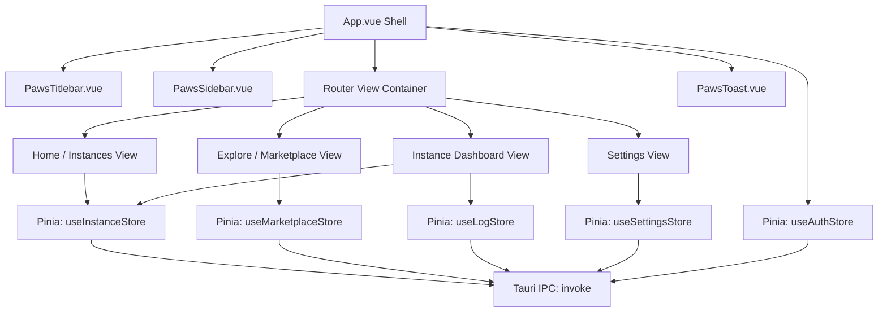

# 🏗️ PawsMC Technical Architecture Specification

This document provides a deep technical breakdown of the Modrinth App (`modrinth/theseus`) codebase to facilitate a seamless fork and redesign for **PawsMC**.

---

## 1. Modrinth ("Theseus") Repository Layout

```
theseus/
├── Cargo.toml                    # Rust workspace manifest
├── package.json                  # Root npm/pnpm workspace
├── tauri.conf.json               # Tauri v1/v2 configuration
├── src-tauri/                    # Rust Backend & Tauri bindings
│   ├── src/
│   │   ├── main.rs               # App entrypoint, window initialization, system tray
│   │   ├── commands/             # Tauri IPC Command handlers invoked by Vue
│   │   │   ├── auth.rs           # Microsoft/Mojang/Modrinth OAuth handlers
│   │   │   ├── instances.rs      # Create, delete, edit, launch, list instances
│   │   │   ├── mods.rs           # Enable/disable/delete/update mods
│   │   │   ├── modrinth.rs       # Modrinth API proxy / cached query endpoints
│   │   │   ├── java.rs           # Java discovery, auto-download (Adoptium/Zulu)
│   │   │   ├── logs.rs           # Real-time Minecraft process output streamer
│   │   │   ├── settings.rs       # Launcher config load/save
│   │   │   └── system.rs         # OS memory info, open folder in explorer, dialogs
│   │   └── state.rs              # Global Tauri application managed state (Mutex/RwLock)
│   └── Cargo.toml
├── packages/ (or crates/)
│   ├── core/                     # Game launch logic, JVM builders, hash verification
│   ├── modrinth_api/             # Strongly typed API client for api.modrinth.com
│   ├── curseforge_api/           # CurseForge proxy client
│   └── auth/                     # Xbox Live, Mojang, Microsoft OAuth2 token exchange
└── src/ (or frontend/)           # Vue 3 Frontend
    ├── main.ts                   # Vue app initialization, Pinia, Router, Plugins
    ├── App.vue                   # Root component, titlebar frame, global modals & toasts
    ├── router/                   # Vue Router route definitions
    │   └── index.ts
    ├── stores/                   # Pinia state stores
    │   ├── instances.ts          # State of installed instances, active instance
    │   ├── auth.ts               # Active Minecraft profile, skins, tokens
    │   ├── marketplace.ts        # Search queries, filters, categories, cached projects
    │   ├── settings.ts           # Launcher user settings & theme preferences
    │   ├── downloads.ts          # Active download tasks and progress percentage
    │   └── console.log.ts        # Live process logs from running Minecraft instances
    ├── components/               # Reusable UI Components
    │   ├── layout/               # Titlebar, Sidebar, StatusBar, ModalContainer
    │   ├── instances/            # InstanceCard, InstanceGrid, InstanceCreateModal
    │   ├── marketplace/          # ProjectCard, SearchBar, FilterBar, VersionPicker
    │   ├── instance-detail/      # ModList, ShaderList, WorldList, LogViewer, SettingsTab
    │   └── common/               # PawsButton, PawsInput, PawsBadge, PawsSwitch, PawsSlider
    └── assets/                   # SVG Icons, Theme CSS, Font declarations
```

---

## 2. Comprehensive Rebranding Mapping Table

| Original Property / Path | Original Value (Modrinth) | PawsMC New Value | Target Files |
| :--- | :--- | :--- | :--- |
| **Product Name** | `Modrinth App` / `Theseus` | `PawsMC` | `tauri.conf.json`, `Cargo.toml`, `package.json` |
| **Bundle Identifier** | `app.modrinth.theseus` | `com.pawsmc.launcher` | `tauri.conf.json` |
| **App Title** | `Modrinth App` | `PawsMC Launcher` | `tauri.conf.json`, `index.html` |
| **Windows Data Dir** | `%APPDATA%/ModrinthApp` | `%APPDATA%/PawsMC` | `src-tauri/src/state.rs`, `paths.rs` |
| **Linux Data Dir** | `~/.config/ModrinthApp` | `~/.config/pawsmc` | `src-tauri/src/paths.rs` |
| **macOS Data Dir** | `~/Library/Application Support/ModrinthApp` | `~/Library/Application Support/PawsMC` | `src-tauri/src/paths.rs` |
| **User Agent** | `modrinth/theseus/{version}` | `PawsMC/{version} (support@pawsmc.com)` | API Client setup (`src-tauri/`) |
| **App Icons** | Modrinth Green 'M' | PawsMC Paw/Cyber Brand Icon | `src-tauri/icons/*`, `public/favicon.ico` |
| **Window Frame** | Standard Titlebar | Frameless (`decorations: false`, Custom UI) | `tauri.conf.json` |

---

## 3. Core Tauri IPC Command Contracts

The frontend interacts with Rust via `invoke(command_name, args)`. Claude Opus must retain these signatures to guarantee 100% backend compatibility:

### 1. Instances & Launch Lifecycle
- `invoke('get_instances') -> Promise<Instance[]>`
- `invoke('create_instance', { name, version, loader, icon }) -> Promise<Instance>`
- `invoke('launch_instance', { instanceId }) -> Promise<void>`
- `invoke('kill_instance', { instanceId }) -> Promise<void>`
- `invoke('delete_instance', { instanceId, deleteFiles }) -> Promise<void>`
- `invoke('export_instance_mrpack', { instanceId, targetPath }) -> Promise<void>`
- `invoke('import_instance_pack', { packPath }) -> Promise<Instance>`

### 2. Mod & Content Management
- `invoke('get_instance_mods', { instanceId }) -> Promise<InstalledMod[]>`
- `invoke('toggle_mod', { instanceId, modFileName, enabled }) -> Promise<void>`
- `invoke('delete_mod', { instanceId, modFileName }) -> Promise<void>`
- `invoke('install_mod_version', { instanceId, versionId }) -> Promise<void>`
- `invoke('check_mod_updates', { instanceId }) -> Promise<ModUpdateResult[]>`

### 3. Authentication & Profiles
- `invoke('start_microsoft_login') -> Promise<AuthUrl>`
- `invoke('get_accounts') -> Promise<MinecraftAccount[]>`
- `invoke('set_active_account', { accountId }) -> Promise<void>`
- `invoke('remove_account', { accountId }) -> Promise<void>`

### 4. Marketplace & Search
- `invoke('search_modrinth', { query, facets, sort, limit, offset }) -> Promise<SearchResponse>`
- `invoke('get_modrinth_project', { projectIdOrSlug }) -> Promise<ProjectDetails>`
- `invoke('get_project_versions', { projectId, mcVersion, loader }) -> Promise<ProjectVersion[]>`

### 5. System & Files
- `invoke('open_instance_folder', { instanceId, subfolder }) -> Promise<void>`
- `invoke('get_system_memory') -> Promise<{ total_mb: number, available_mb: number }>`
- `invoke('find_installed_javas') -> Promise<JavaRuntime[]>`

---

## 4. Frontend State & Pinia Store Architecture



---

## 5. Security & Stability Guarantees

1. **Token Protection**: Microsoft OAuth refresh tokens and Xbox Live user tokens must remain securely encrypted in the OS Keyring/Keystore via Rust's `keyring-rs` crate (standard in `theseus`).
2. **Crash Resilience**: When a Minecraft instance crashes, the Tauri backend emits a `game-crash` event containing exit code and crash report path. The frontend UI must catch this and trigger an intuitive **Crash Diagnostic Modal** with one-click copy and auto-translated common fixes (e.g. Incompatible mods, Out of Memory).
3. **Safe File Operations**: All file manipulations (deletions, `.jar` extraction, folder opening) must be sandboxed and validated through Rust path canonicalization to prevent path traversal issues.
