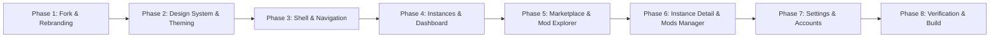

# 📋 PawsMC Step-by-Step Execution Plan

This execution plan guides Claude Opus through the step-by-step implementation of the **PawsMC** launcher from the base `modrinth/theseus` repository.

---

## 🎯 Phase Overview

---

## 🚀 Detailed Phase Tasks

### Phase 1: Repository Setup & Complete Rebranding
- [ ] **1.1 Clone Base Repository**: Clone `https://github.com/modrinth/theseus.git`.
- [ ] **1.2 Package Metadata**:
  - Update `package.json` with name `"pawsmc-launcher"`, description `"The ultimate Minecraft launcher experience"`.
  - Update `Cargo.toml` workspace manifests.
- [ ] **1.3 Tauri Configuration (`tauri.conf.json`)**:
  - Set `package.productName = "PawsMC"`
  - Set `tauri.bundle.identifier = "com.pawsmc.launcher"`
  - Set `tauri.windows[0].title = "PawsMC Launcher"`
  - Set `tauri.windows[0].decorations = false` (custom frameless window).
  - Set minimum window dimensions: `width = 1080`, `height = 700`.
- [ ] **1.4 Brand Assets**:
  - Replace `src-tauri/icons/` with custom PawsMC icons (paw logo in `.ico`, `.png`, `.icns`).
  - Update HTML page title and favicon in `index.html`.
- [ ] **1.5 Path & State Updates**:
  - Update default config & data storage path from `ModrinthApp` to `PawsMC` in Rust path resolvers (`src-tauri/src/paths.rs`).

---

### Phase 2: Design System & Core Styles
- [ ] **2.1 Token Implementation**:
  - Create `src/assets/styles/theme.css` with dark mode variables, neon violet/cyan accents, and glassmorphism utilities.
  - Configure TailwindCSS / UnoCSS theme extensions for Paws colors (`paws-purple`, `paws-cyan`, `paws-dark`).
- [ ] **2.2 Base Component Kit (`src/components/common/`)**:
  - `PawsButton.vue`: Variants (`primary`, `secondary`, `danger`, `ghost`, `glass`) with loading spinners.
  - `PawsInput.vue`: Glowing search and text input with clear button and icon slots.
  - `PawsBadge.vue`: Status chips for Fabric, Forge, NeoForge, Quilt, and Minecraft versions.
  - `PawsSwitch.vue`: Tactile toggle switch for mod activation and settings.
  - `PawsSlider.vue`: Custom RAM allocation slider with memory usage marks.
  - `PawsModal.vue`: Animated modal dialog with glass backdrop.
  - `PawsToast.vue`: Floating toast notifications for download completions and errors.

---

### Phase 3: Shell, Custom Titlebar & Navigation
- [ ] **3.1 Frameless Window Controls**:
  - Implement `PawsTitlebar.vue` with drag region (`data-tauri-drag-region`).
  - Wire native window controls (minimize, toggle maximize, close) using `@tauri-apps/api/window`.
  - Add active user profile head avatar and quick account switcher.
- [ ] **3.2 Navigation Sidebar (`PawsSidebar.vue`)**:
  - Create links:
    - 🏠 `Instances` (`/instances`)
    - 🧭 `Marketplace` (`/explore`)
    - 📥 `Downloads Queue` (`/downloads`)
    - ⚙️ `Settings` (`/settings`)
  - Implement smooth page transitions in `App.vue` (`<router-view v-slot="{ Component }">`).
- [ ] **3.3 Global Spotlight Search (`Ctrl+K`)**:
  - Add modal for instant instance searching and launching with keyboard shortcuts.

---

### Phase 4: Instances & Home Dashboard Redesign
- [ ] **4.1 Dashboard Layout (`HomeView.vue`)**:
  - Top action bar: "New Instance", "Import Pack (.mrpack/.zip)", "Refresh", View Toggle (Grid / List).
  - Search/Filter bar for local instances.
- [ ] **4.2 Instance Card (`InstanceCard.vue`)**:
  - Render custom banner image or procedural Minecraft gradient.
  - Badges for Version, Loader, Mod count, Last Played.
  - Action button:
    - Launch game via `launch_instance` IPC call.
    - Real-time launch state updates (Downloading libraries -> Allocating RAM -> Launching -> Running).
  - Context menu: Open folder, Edit, Duplicate, Export, Delete.
- [ ] **4.3 Create Instance Wizard (`CreateInstanceModal.vue`)**:
  - Step 1: Instance Name, Icon & Banner.
  - Step 2: Minecraft Version (Release / Snapshot) + Loader (Fabric / Forge / NeoForge / Quilt).
  - Step 3: Optional Quick Mod Selection (Sodium, Iris, Lithium).

---

### Phase 5: Marketplace & Mod Explorer
- [ ] **5.1 Explorer Layout (`MarketplaceView.vue`)**:
  - Query Modrinth API / CurseForge API via Rust backend.
  - Search input with debounce.
  - Filter pills: Project Type (Mod, Modpack, Resource Pack, Shader), Game Version, Loader, Categories.
- [ ] **5.2 Project Card (`ProjectCard.vue`)**:
  - Project Icon, Title, Author, Description, Download Stats.
  - "1-Click Install": Dropdown displaying compatible local instances to install into.
- [ ] **5.3 Project Details Drawer (`ProjectDetailsModal.vue`)**:
  - Markdown-rendered README/Description.
  - Screenshot gallery lightbox.
  - Version selector tab with changelog view and direct download trigger.

---

### Phase 6: Instance Management & Details View
- [ ] **6.1 Instance Header**:
  - Big banner, Quick Play button, Total Playtime, Open Folder button.
  - Sub-navigation tabs: `Mods`, `Resource Packs`, `Shaders`, `Worlds`, `Screenshots`, `Console`, `Settings`.
- [ ] **6.2 Mod Manager Tab (`ModsTab.vue`)**:
  - Table of installed `.jar` files.
  - Switch to toggle enable/disable (renames to `.disabled` or updates pack manifest).
  - Drag-and-drop file drop zone to add `.jar` files from file explorer.
  - "Check for Updates" button that queries Modrinth for newer mod versions.
- [ ] **6.3 Live Console & Log Viewer (`LogsTab.vue`)**:
  - Real-time terminal output stream from running Minecraft process.
  - Syntax colorizer for `[INFO]`, `[WARN]`, `[ERROR]`, `[FATAL]`.
  - Text search filter with regex support.
  - "Copy Log" and "Upload to mclo.gs / Pastebin" buttons.
- [ ] **6.4 Instance Settings Tab (`InstanceSettingsTab.vue`)**:
  - Per-instance RAM allocation slider.
  - Custom JVM flags editor.
  - Java runtime version selector.

---

### Phase 7: Settings & Account Management
- [ ] **7.1 Launcher Settings (`SettingsView.vue`)**:
  - Default RAM Allocation and JVM paths.
  - Launcher behavior on game launch (Keep Open / Minimize / Close).
  - Custom background wallpaper picker.
  - Discord Rich Presence toggle (custom PawsMC presence with instance name and playtime).
- [ ] **7.2 Accounts Page (`AccountsView.vue`)**:
  - Microsoft Login button (spawns loopback OAuth listener).
  - Account list with 3D skin rendering preview.
  - Switch active profile in 1 click.

---

### Phase 8: Verification, Testing & Packaging
- [ ] **8.1 Frontend Build Check**:
  - Run `pnpm build` or `pnpm type-check` to verify 0 TypeScript/Vue compiler errors.
- [ ] **8.2 Rust / Tauri Check**:
  - Run `cargo check` and `cargo test` in `src-tauri`.
- [ ] **8.3 Full App Bundle Generation**:
  - Run `pnpm tauri build` to generate `.msi` / `.exe` (Windows), `.AppImage` / `.deb` (Linux), `.dmg` (macOS).
